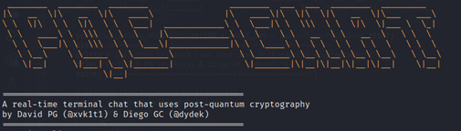

<a name="readme-top"></a>

<h1 align="center">PQC-Chat</h1>

<!-- ABOUT THE PROJECT -->
## About The Project

<div align="center">
  <a href="https://github.com/xvk1t1/pqc-chat.git">
    
  </a>
</div>
<br/>

PQC-Chat allows you to exchange messages in real time with another user through a chat server using post-quantum cryptography.

<a href="https://github.com/xvk1t1/pqc-chat.git">
  <p align="right">(<a href="#readme-top">back to top</a>)</p>
</a>


## Installation

1. Clone the repo
   ```sh
   git clone https://github.com/xvk1t1/pqc-chat.git
   ```
2. Install liboqs library (https://github.com/open-quantum-safe/liboqs-python)

3. Run
   ```sh
   python3 pqc_chat.py [flags]
   ```

<p align="right">(<a href="#readme-top">back to top</a>)</p>


<!-- USAGE EXAMPLES -->
## Usage

To run the application, use the following command:
   ```sh
   python3 pqc_chat.py [flags]
   ```
Below are the different flags supported by the program:

- `-h, --help`: displays the help message.
- `-m, --mode {server,client}`: allows selecting the mode in which the application should run, either as a server or client.
- `-a, --ip`: the IP address on which the server will be hosted or the IP address to which the client will connect. If omitted, the default IP address is set to 127.0.0.1.
- `-p, --port`: the port to use. If omitted, the default port is set to 12345.
- `-v, --verbose`:  prints cryptographic parameters such as the shared secret and client's public key to the console.

It is necessary to start the server before attempting to establish a client connection. Once the server is running, it will wait for a client to connect.

After the connection between the client and server is established, you can start exchanging messages. Simply type the text you want to send and press the ENTER key to send the message.

To end the execution, either of the two parties can type "bye" in the chat. At that moment, the program execution will terminate for both parties.


<p align="right">(<a href="#readme-top">back to top</a>)</p>


<!-- LICENSE -->
## License

Distributed under the GNU General Public License v3.0. See `LICENSE` for more information.

<p align="right">(<a href="#readme-top">back to top</a>)</p>


[product-screenshot]: images/pqc-chat_header.png
